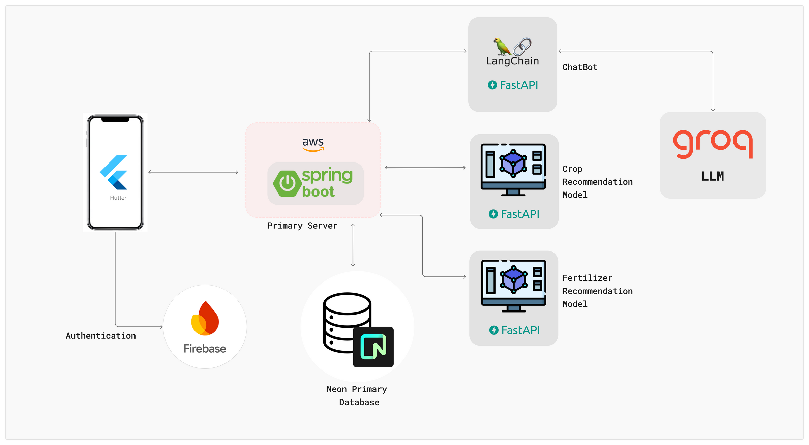
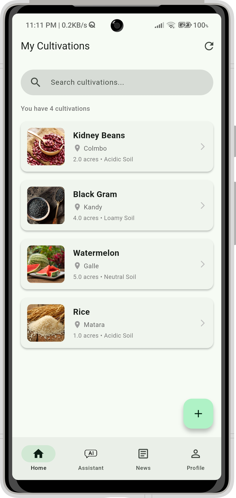
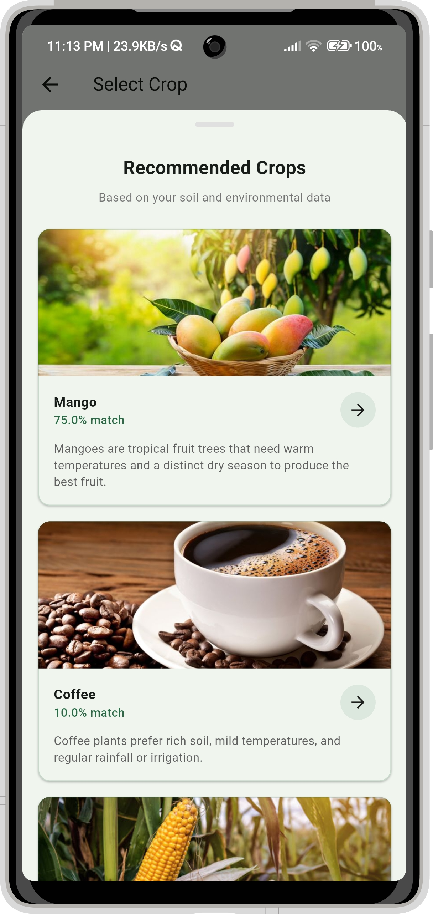
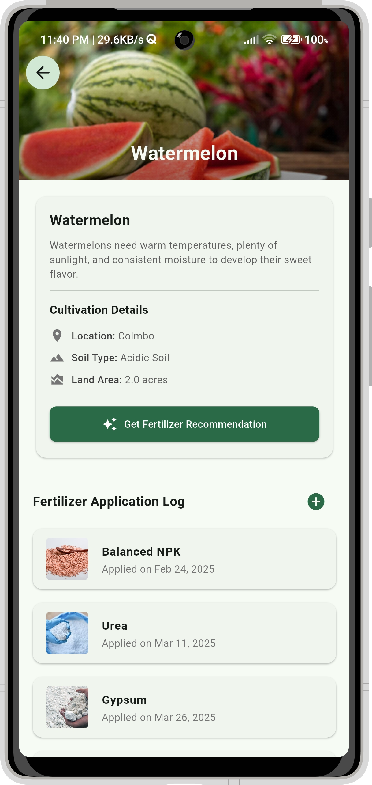
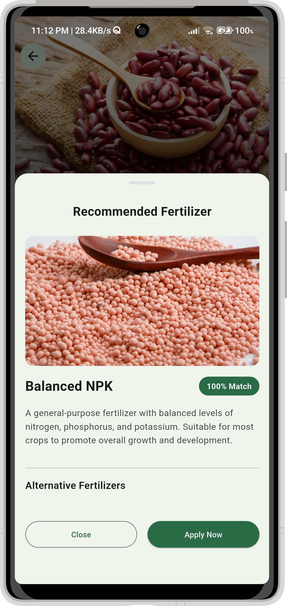
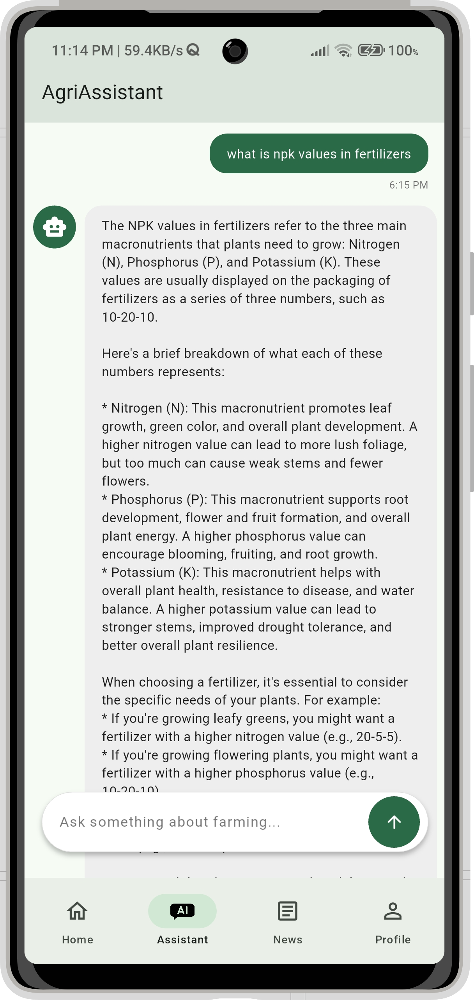
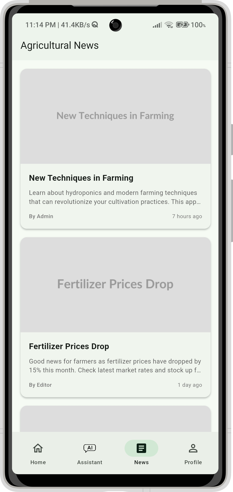
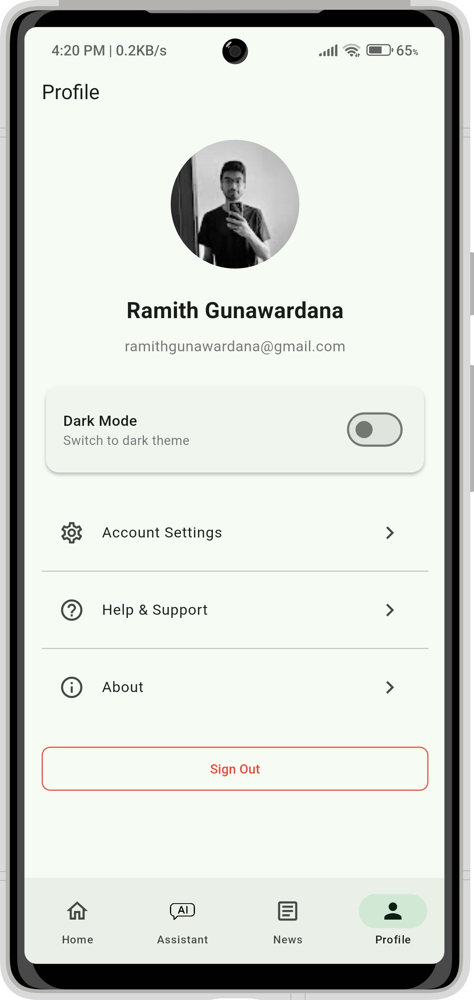
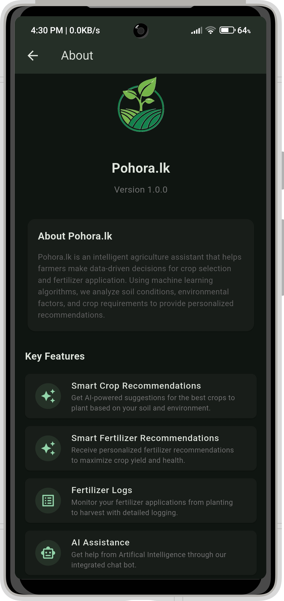

# පොහොර.LK 🌾

A comprehensive Machine Learning-powered agriculture assistant that recommends optimal fertilizers for crops based on soil and environmental conditions. This course work assignment was done for the Machine Learning module in fourth year first semester.

<p align="center">  </p> 

## 🌟 Overview

පොහොර.LK is an intelligent agriculture solution that integrates mobile technology with machine learning to help farmers make data-driven decisions. The platform analyzes soil conditions, environmental factors, and crop requirements to provide personalized fertilizer recommendations and agricultural advice.

## 🚀 Features
 - **AI-Powered Crop Recommendations:** Get tailored crop suggestions based on your soil parameters and environmental factors
 - **AI-Powered Fertilizer Recommendations:** Get recommended fertilizers based on your crop and soil parameters
 - **Crop Management:** Track multiple cultivations with detailed logging
 - **Fertilizer Application History:** Monitor and record fertilizer usage over time
 - **Smart Chatbot Assistant:** Get farming advice and answers to agricultural questions
 - **Dark Mode Support:** Comfortable viewing experience in all lighting conditions
 - **User Authentication:** Secure account management with Firebase

## 🏗️ Architecture

<p align="center">  </p>

## 🛠️ Tech Stack

Frontend
 - **Flutter:** Cross-platform mobile application framework
 - **BLoC Pattern:** State management solution
 - **Firebase Authentication**: User management

Backend
 - **Spring Boot:** Primary application server
 - **AWS ECS/ECR:** Container hosting and registry
 - **Neon DB:** PostgreSQL cloud database
 - **FastAPI:** ML recommendation service
 - **Koyeb:** Hosting for FastAPI recommendation service

AI Components
 - **scikit-learn:** Machine learning models
 - **LangChain**: Framework for LLM applications
 - **Groq LLM:** Large language model provider
 - **FastAPI:** Chatbot service

📁 Project Structure

```
pohora.lk/
├── app/                        # Flutter mobile application
│   └── pohora_lk/              # Main Flutter project
│       ├── lib/                # Dart source code
│       │   ├── blocs/          # State management
│       │   ├── data/           # Data models & services
│       │   └── presentation/   # UI components
│       ├── assets/             # Images and static files
│       └── pubspec.yaml        # Flutter dependencies
├── data/                       # Crop & fertilizer datasets
│   ├── crop.csv                # Crop dataset
│   ├── fertilizer.csv          # Fertilizer dataset
│   └── fertilizer_dataset.csv  # Combined training dataset
├── intelligence/               # AI chatbot service
│   ├── chat/                   # Chatbot functionality
│   ├── models/                 # LLM integration
│   ├── providers/              # LLM providers
│   ├── recommendation/         # Additional ML logic
│   ├── Dockerfile              # Container definition
│   ├── main.py                 # Entry point
│   └── requirements.txt        # Python dependencies
├── models/                     # Exported ML model files
│   ├── encoder.pkl             # Feature encoder
│   ├── label_encoder.pkl       # Label encoder
│   ├── fertilizer_recommender_decision_tree.pkl
│   ├── random_forest.pkl       # Random forest model
│   └── svm.pkl                 # SVM model
├── notebooks/                  # Jupyter notebooks
│   ├── CropRecommendation.ipynb
│   ├── FertilizerRecommendation.ipynb
│   └── experiments/            # Additional experiments
├── server/                     # Spring Boot backend
│   └── ...                     # Server code and configuration
├── .gitignore
├── LICENSE                     # MIT License
├── README.md                   # This file
└── requirements.txt            # Python dependencies
```
## 🧰 Getting Started

### Prerequisites
 - Flutter SDK (3.7.0+)
 - Python 3.8+ (for ML services)
 - Java 17+ (for Spring Boot)
 - Docker (for containerization)
 - AWS CLI (for deployment)

### Running the Flutter App
1. Navigate to the app directory:
    ```bash
    cd app/pohora_lk
    ```

2. Install dependencies:
    ```bash
    flutter pub get
    ```

3. Run the app:
    ```bash
    flutter run

   ```
### Backend Setup
1. Navigate to the server directory:
    ```bash
    cd server
    ```
2. Build with Maven:
    ```bash
    ./mvnw clean package
    ```
3. Run locally:
    ```bash
    java -jar target/pohora-0.0.1-SNAPSHOT.jar
    ```

### ML Services
1. Install Python dependencies:
    ```bash
    pip install -r requirements.txt
    ```
2. Run the recommendation service:
    ```bash
    cd intelligence
    uvicorn main:app --reload
    ```
## 🧠 Machine Learning Models
The recommendation system uses multiple ML models to suggest crops & fertilizers:

 - **Random Forest:** Crop recommendation model
 - **Decision Tree:** Fertilizer recommendation model

Models are trained on agricultural data including soil parameters (N, P, K levels) and environmental conditions (temperature, humidity).

## 📱 Key App Screens
 - **Login & Registration:** User authentication
 - **Home Dashboard:** Overview of all cultivations
 - **Crop Details:** Detailed information fertilizer recommendations and logs
 - **Chatbot Interface:** Interactive farming assistance
 - **Agri News:** Latest news and tips for farmers
 - **Profile Settings:** User preferences and account management

## 🖼️ Screenshots
<table>
<tr>
<th>Sign In</th>
<th>Home</th>
<th>Crop Recommendation</th>
</tr>
<tr>
<td></td>  
<td></td>
<td></td>
</tr>
<tr>
<th>Crop Details</th>
<th>Fertilizer Recommendation</th>
<th>Chat bot</th>
</tr>
<tr>
<td></td>  
<td></td>
<td></td>
</tr>
<tr>
<th>News</th>
<th>Profile</th>
<th>Dark Mode</th>
</tr>
<tr>
<td></td>  
<td></td>
<td></td>
</tr>
</table>

## 📄 License
This project is licensed under the MIT License - see the [LICENSE](LICENSE) file for details.

## 🤝 Team Members
 - [Ravindu Aratchige](https://github.com/ravi-aratchige) - ML Engineer
 - [Ramith Gunawardana](https://github.com/Ramith-Gunawardana) - Mobile Developer
 - [Lasindu Ranasinghe](https://github.com/lasindu-ranasinghe) - Backend Developer
 - Sohani Weerasinghe - UI/UX Designer
 - Yasitha Dhananya - Project Manager

## 🙏 Acknowledgments
 - The Flutter team for the cross-platform framework
 - Firebase for authentication services
 - AWS for reliable cloud infrastructure
 - Groq for advanced LLM capabilities
 - The scikit-learn community for ML tools
 - All our team members and supporters
 
 ---

 <p align="center"> <i>Helping farmers grow better crops through intelligent recommendations</i> </p>